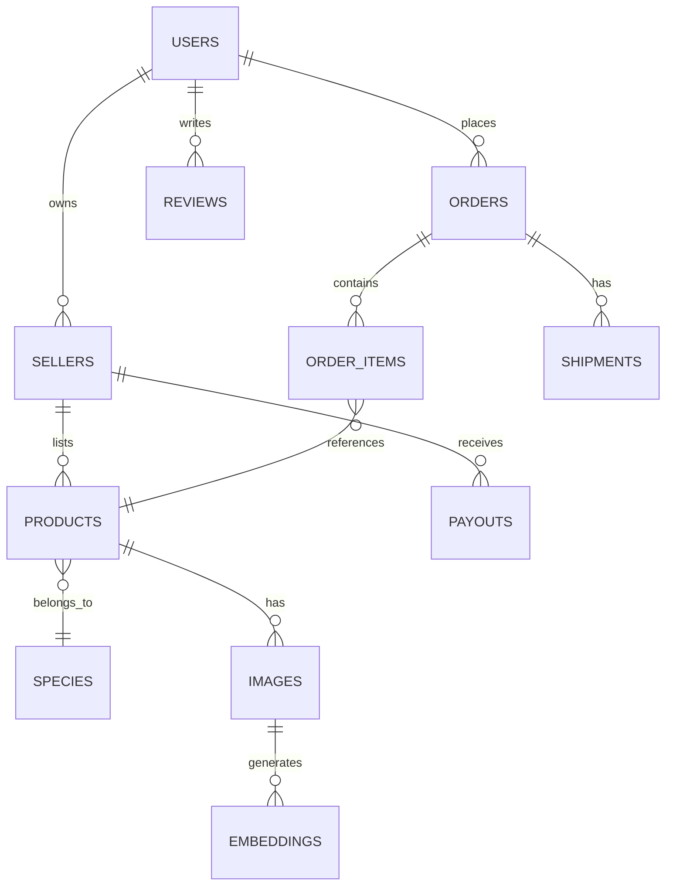
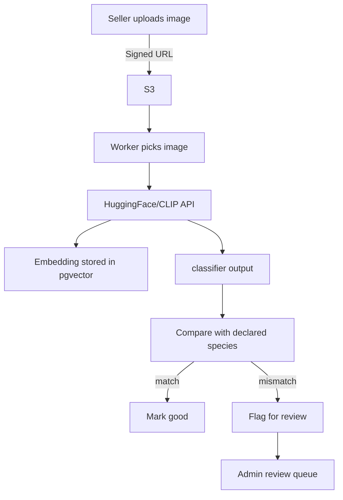

# 🌳 TreeVerse — AI‑Powered Tree & Plant Marketplace

A production‑grade, multi‑vendor marketplace for buying and selling trees, built with **Next.js, TypeScript, DDD architecture, CI/CD, Terraform, Vector Search, and Free AI APIs**. This project is designed as a **resume‑ready, recruiter‑impressing flagship project** demonstrating real engineering, system design, and advanced product thinking.

---

## 🚀 1. Project Overview

TreeVerse is an AI‑enhanced marketplace where:

* **Buyers** discover trees using advanced search, AR previews, and growth simulations.
* **Sellers** list trees with verification checks, analytics, price suggestions, and inventory management.
* **AI systems** classify species from images, generate care plans, perform similarity search, and detect listing fraud.

This project mimics real enterprise marketplaces with a modern, scalable, event‑driven architecture.

---

## ⭐ 2. Key Goals

This project is intentionally designed to:

* Demonstrate **production-level engineering**.
* Use **modern architecture** (DDD, modular monorepo, event-driven).
* Showcase **AI integrations using free/opensource APIs**.
* Impress recruiters by solving **domain-specific real problems**.
* Highlight **systems thinking**, DX, and maintainability.

---

## 📦 3. Major Features (Recruiter-Impressing)

### 🔥 **AI + ML Powered**

* **Species Verification AI** – uploaded images checked against declared species.
* **AI Care Plan Generator** – watering, fertilizing, sunlight, pruning schedule.
* **ML-Powered Image Search** – find trees by uploading a picture.
* **AI Listing Quality Score** – image quality, species accuracy, SEO score.
* **AI Seller Price Suggestion** – based on demand, species rarity, region.
* **AI Growth Simulator** – visual timeline for expected tree growth.

### 🛒 **Marketplace Features**

* Multi-vendor marketplace: sellers, storefronts, payouts.
* Real checkout with **Stripe Connect**.
* Inventory, variants (age, size, pot type).
* Geo-based seller recommendations.
* Advanced order tracking + fulfillment.

### 📱 **Advanced User Experiences**

* AR preview for tree placement.
* 3D viewer for tree models.
* Carbon sequestration estimator.
* Local delivery optimization.
* Care calendar export (Google Calendar / ICS).

### 🧩 **Engineering & Architecture Features**

* Domain‑Driven Design (**DDD**) with clear bounded contexts.
* Event-driven modules with background jobs.
* CI/CD with GitHub Actions + Branch Environments.
* Infrastructure as Code (**Terraform**) for reproducible deployments.
* Observability: Sentry, structured logs, metrics.
* Testing suite: unit + integration + e2e.
* Fully typed with strict **TypeScript**.
* Storybook + shared UI design system.
* Performance optimized: ISR/SSG, caching, image optimization.

### Free AI APIs You Can Use

* **HuggingFace free inference endpoints** (image classification, embeddings)
* **Free CLIP embeddings** (image similarity)
* **Google Gemini Free Tier** (text content generation)
* **OpenAI Free Embeddings (3rd-party mirrors)**
* **Replicate free hosted models**
* **Tesseract OCR (free, local)**

---

## 📚 4. Domain-Driven Design (DDD) Structure

### Bounded Contexts

1. **Catalog** — Species, products, metadata.
2. **Marketplace** — Listings, pricing, seller dashboard.
3. **Orders + Payments** — Checkout, payouts, refunds.
4. **Fulfillment** — Shipping, delivery, logistics.
5. **Identity** — Users, authentication, roles.
6. **AI & ML Services** — classification, embeddings, recommendations.
7. **Notifications** — email, SMS, push.
8. **Analytics** — metrics, dashboards.

Each context has:

* Entities
* Value objects
* Aggregates
* Application layer
* Repositories
* Domain events

---

## 🏗 5. High-Level Architecture

### Frontend

* Next.js (App Router)
* TypeScript
* Tailwind + shadcn/ui
* TanStack Query
* Zustand for local UI states
* Storybook-driven UI

### Backend

* Next.js Server Routes
* PostgreSQL + Prisma
* Redis + BullMQ
* pgvector or open-source vector DB
* S3 storage (or local MinIO)

### AI Layer

* CLIP embeddings API
* HF image classification model
* Free text LLM for summaries & care guides

### Infrastructure

* Terraform (AWS / DO / Railway)
* GitHub Actions CI/CD
* Dockerized worker service

### Observability

* Sentry
* Logging (pino)
* Metrics (Prometheus-compatible)

---

## 🗂 6. Project Folder Structure (Monorepo)

```
/apps
  /web      → Next.js app
  /worker   → Background jobs (BullMQ)
/packages
  /ui       → Shared component library (Storybook)
  /core     → Domain logic (DDD modules)
  /config   → ESLint, tsconfig, tailwind config
/infrastructure
  /terraform
/scripts
/tests
```

---

## 🧠 7. AI Integrations (Free API Examples)

### 1. Image Classification (Free)

Use HuggingFace model like `vit-base-patch16-224`:

* Identify species
* Compare with seller label
* Flag mismatches

### 2. Image Embeddings + Search

Use CLIP embeddings and store vectors in Postgres (pgvector).

### 3. Care Plan Generation (Gemini Free Tier)

* Generate watering schedule
* Seasonal care instructions
* Growth expectations

### 4. Auto-SEO Description Generator

* Write product titles
* Suggest keywords
* Create metadata

---

## 📐 8. Database Schema (Simplified)

```
User
Seller
Product
Species
Listing
Order
OrderItem
Shipment
Image
Embedding
Review
Payout
Notification
```

---

## 🔄 9. Event-Driven Workflow Examples

### Order Flow

1. `OrderPlaced`
2. Payment confirmed → `PaymentCompleted`
3. Create shipment → `ShipmentCreated`
4. Notify buyer + seller

### AI Verification Flow

1. Seller uploads image
2. Worker → classify species
3. Compare vs label
4. If mismatch → `SpeciesMismatchDetected`
5. Flag listing for review

---

## ✔️ 10. Testing Strategy

### Unit tests

* Domain logic (entities, aggregates)

### Integration tests

* API routes via supertest
* Database interactions

### e2e tests

* Playwright flows: sign in → list → checkout → track order

### Additional

* Component tests via Storybook interactions

---

## 📈 11. Performance Optimizations

* ISR for product pages
* Image CDN optimization
* Database indexes on species, price, region
* Query caching with TanStack Query
* Edge caching

---

## 🛡 12. Security

* Signed URL uploads
* Rate limiting
* Input validation (Zod)
* Audit logs
* Roles & permissions (buyer, seller, admin)

---

## 🧰 13. DevOps & CI/CD

* Lint → Typecheck → Tests → Build → Deploy
* PR preview deployments
* Versioned releases
* Environment-based secrets

---

## ⚙️ 14. Terraform Resources

* VPC / Networking
* Postgres DB
* Redis
* S3 Bucket
* CloudFront CDN
* IAM roles

---

## 💡 15. Pages & Routes

### Public

* / — homepage
* /search
* /product/[id]
* /species/[id]
* /ar-preview/[id]

### Seller

* /seller/dashboard
* /seller/listings
* /seller/orders
* /seller/analytics

### Buyer

* /cart
* /checkout
* /orders/[id]

### Admin

* /admin/listings
* /admin/users
* /admin/ai-flags

---

## 🧲 16. Advanced Features (Showcase)

* Tree health detection from images
* Seller A/B pricing experiments
* Auto-detect plant diseases (open-source models)
* Tree insurance add-on (mock feature)
* Bulk CSV import with live validation

---

## 🎯 17. What Recruiters Will Love

* Real marketplace
* Complex architecture
* AI-heavy features
* CI/CD with infrastructure
* DDD + modular monorepo
* Professional documentation
* Clean UI library + Storybook
* Testing + observability
* Performance-focused design
* Realistic workflows + domain logic

---

## 📄 18. Resume-Ready Description

**TreeVerse — AI‑Powered Tree Marketplace**
A full-stack, production-grade, multi-vendor tree & plant marketplace with AI-powered listing verification, image-based search, species classification, AR previews, real checkout (Stripe Connect), an event-driven backend, and a complete DDD-based Next.js architecture.

Technologies: Next.js, TypeScript, PostgreSQL, Prisma, Tailwind, shadcn/ui, Redis, BullMQ, Terraform, HuggingFace, Gemini API, pgvector, S3, CI/CD, Playwright.

---

## 🚀 19. Next Steps / Roadmap

* Add disease detection ML pipeline
* Add community Q&A on species
* Add 3D models for more species
* Add seller subscription plans
* Add SMS notifications

---

## 📢 20. Final Notes

This project is intentionally crafted to look like a **real-world, production-ready SaaS/Marketplace**. It demonstrates modern engineering, AI integration, deep product decisions, and clean architecture — everything recruiters search for in a strong candidate.

You can copy this file as your project **README.md**.

---

# 🔧 Additional Deliverables (added on request)

The sections below were appended: System Design Diagram, Database ERD (Mermaid), AI workflow diagrams, Architecture PDF (generated), Pitch Deck for recruiters, and a Full PRD. You can find the full text, diagrams, and downloads attached.

## 🗺 System Design Diagram (Mermaid - high level)

```mermaid
flowchart LR
  subgraph FE[Frontend]
    A[Next.js App] -->|HTTP| B[API Gateway / Server Routes]
    A --> CDN
  end

  subgraph BE[Backend]
    B --> C[Auth Service (Identity)]
    B --> D[Catalog Service]
    B --> E[Marketplace Service]
    B --> F[Orders & Payments]
    B --> G[Fulfillment Service]
    B --> H[AI & ML Service]
    B --> I[Worker Queue (BullMQ)]
  end

  subgraph Infra
    CDB[(Postgres + pgvector)]
    S3[S3/MinIO]
    REDIS[(Redis)]
    VECTOR[Vector DB / pgvector]
    STRIPE[Stripe]
    CDN[CDN]
  end

  H --> VECTOR
  D --> CDB
  E --> CDB
  F --> CDB
  G --> CDB
  I --> REDIS
  I --> S3
  F --> STRIPE
  A -->|Websockets| J[Realtime/Notifications]
  J --> I
```

## 🧾 Database ERD (Markdown + Mermaid)



## 🤖 AI Workflow Diagrams (Mermaid)

### Image Verification & Embedding Flow



### Care Plan & Content Generation Flow

```mermaid
flowchart TD
  Order[Order Completed] --> Trigger[Trigger: generate care plan]
  Trigger --> LLM[Free LLM (Gemini/Free API)]
  LLM --> CarePlan[Generate schedule & ICS]
  CarePlan --> Email[Send to buyer]
  CarePlan --> Calendar[Add ICS / Google Calendar link]
```

---

## 📐 Architecture PDF & Pitch Deck

* A PDF containing: architecture overview, system diagram, infrastructure notes, and a 6-slide pitch deck for recruiters has been generated and attached as a downloadable file.

---

## 📋 Full PRD (Product Requirements Document)

### Title

**TreeVerse — AI-Powered Tree & Plant Marketplace**

### Problem Statement

Many marketplaces selling live plants struggle with high return rates, species mislabeling, and shipping damage. Buyers lack confidence in what they receive and sellers lack tools to price, verify, and ship plants safely.

### Goals

* Build a trustworthy marketplace for trees and plants.
* Reduce fraud via image verification and provenance.
* Provide unique buyer experiences (AR, growth simulation).
* Demonstrate modern engineering practices for hiring visibility.

### Target Users

* Home gardeners
* Urban landscapers
* Nurseries & small-scale growers
* Environmental organizations

### Key Features (MVP)

* Product catalog + search
* Seller onboarding & listings
* Stripe checkout
* Order tracking
* Basic AI species verification (free HF model)
* Seller dashboard

### Non-functional Requirements

* Production-grade CI/CD
* Accessibility (WCAG AA)
* 99.9% uptime SLA target for critical flows
* Test coverage: critical flows 80%+

### Success Metrics

* Conversion rate on listings
* Fraud detection rate
* Time-to-ship metric
* Test coverage & pipeline pass rate

### Risks & Mitigations

* Shipping damage — offer local pickup & recommended couriers.
* AI misclassifications — human-in-loop review for flags.
* Perishable inventory — allow local seller options.

### Roadmap

* Month 0–1: Scaffold, DB, core catalog, seller onboarding
* Month 1–2: Checkout, orders, payouts, seller dashboard
* Month 2–3: AI verification, embeddings, image search
* Month 3–4: AR preview, growth simulator, performance hardening

### Appendix

* Tech stack
* Infra notes
* Data retention policy
 